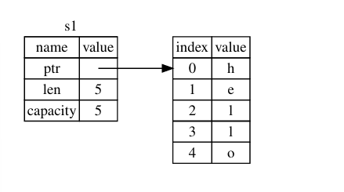
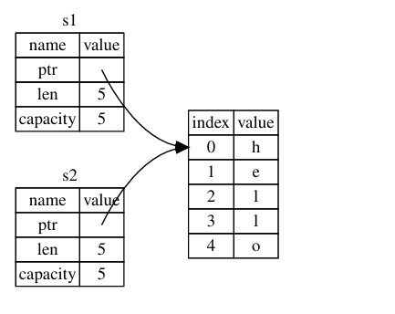
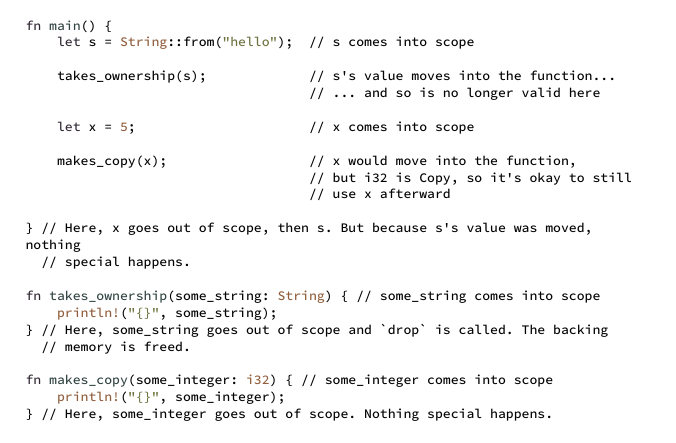
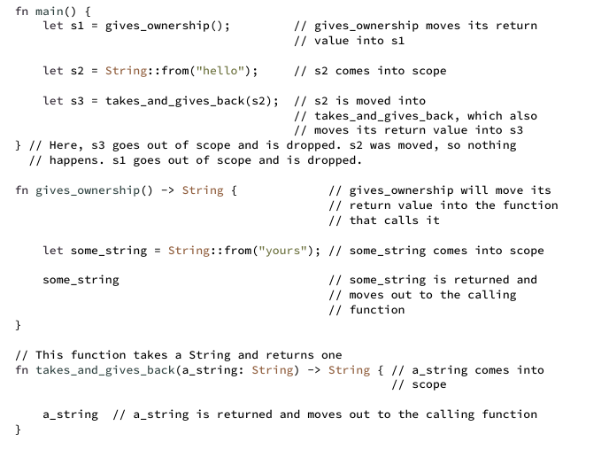

## What is Ownership?

*Ownership* is a set of rules that govern how a Rust program manages memory.
Some languages have garbage collection that regularly looks for no-longer-used memory as the program runs; 
in other languages, the programmer must explicitly allocate and free the memory like C and C++.
Rust come with different approach, manage memory through a system of ownership.

### The Stack and the Heap

Many programming languages don't require you to think about the stack and the heap. But in Rust stack or The heap
affect how the language behaves and why you have to make certain decisions.

Both the stack and the heap are parts of memory available to your code to use at runtime, but they are structured in
different ways. The stack is a memory structure that operates on a last in, first out (LIFO) principle, like a stack of 
plates where new plates are added to the top and removed from the top. Adding data is called pushing, and removing data 
is called popping. All data on the stack must have a fixed, known size at compile time. If the size is unknown or can 
change, the data is stored on the heap instead.

**Stack vs. Heap Speed:**
- Stack: Faster for data allocation since it always adds/removes at the top.
- Heap: Slower because it must search for space and manage bookkeeping.
Data Access:

- Stack: Faster because data is close in memory.
- Heap: Slower as it requires following pointers, which causes memory jumps.

**Function Behavior:**

- Parameters and local variables are stored on the stack.
- When the function ends, these values are removed.

**Ownership Role:**

- Ownership manages heap data by tracking usage, reducing duplication, and cleaning up unused memory.
- This ensures efficient memory use without requiring developers to manually manage the stack and heap.

Understanding ownership minimizes the need to worry about stack and heap differences in Rust.

### Ownership Rules
- Each value in Rust has an *owner*
- There can only ba one owner at a time
- When the owner out of scope, the value will be dropped

### Variable Scope
As a first example of ownership, we'll look at the scope of some variables.
```rust
let s = "hello";
```
The variable *s* refers a string literal, where the value of the string is hardcoded into text of our program.
The variable is valid until the end of the current scope. 
```rust
{                       // s is not valid here, it's not yet declared
    let s = "hello";    // s is valid from this point forward 
}                       // this scope is now over, and s is no longer valid
```
In other words, there are two important points in time here:

- When *s* comes into scope, it is valid
- It remains valid until it goes out of scope

### The String Type

You can create a *string* from a string literal using the *from* function, like so:
```rust
let s = String::from("hello");
```
The double colon :: operator allows us to namespace this particular *from* function under the *string* type rather than
using some sort of name like *string_from* .

This kind of string can be mutated:
```rust
    let mut s = String::from("hello");
    s.pus_str(", world!"); // pus_str() appends a literal to a string
    println!("{}", s); // This will print 'hello, world!`
```

### Memory and Allocation

In languages with a *garbage collector (GC)*, the GC keeps track of and cleans up memory that isn't being used anymore.
In most languages like C and C++ without GC, it's our responsibility to identify when memory is no longer being used and
call code to explicitly free it.

Rust take a different path: the memory is automatically return once the variable that owns it goes out of scope.
Here's a example using string instead of s string literal:
```rust
    let s = String::from("hello"); // s is valid from this point forward
    // do stuff with s
                                   // this scope is now over, and s is no longer valid 
```
When s goes out of scope, Rust calls a special function for us. This function is called *drop*, and it's where
the author of *string* can put the code to return the memory. Rust calls *drop* automatically at the closing curly
bracket.

```rust
Note: In C++, this pattern of deallocating resources at the end of an item’s lifetime is
sometimes called Resource Acquisition Is Initialization (RAII). The drop function in Rust
will be familiar to you if you’ve used RAII patterns.
```
#### Variable and Data Interacting with Move

Multiple variables can interact with the same data in different ways in Rust.

```rust
    let x = 5;
    let y = x;
    // Assigning the integer value of variable x to y
```
This
is indeed what is happening, because integers are simple values with a known, fixed size,
and these two 5 values are pushed onto the stack.
```rust
    // string version
    let s1 =  String::from("hello");
    let s2 = s2;
```
A String is
made up of three parts, shown on the left: a pointer to the memory that holds the contents
of the string, a length, and a capacity. This group of data is stored on the stack. On the right
is the memory on the heap that holds the contents.



*Representation in memory of a String holding the value "hello" bound to s1*

When we assign s1 to s2 , the String data is copied, meaning we copy the pointer, the
length, and the capacity that are on the stack. We do not copy the data on the heap that the
pointer refers to. 



*Representation in memory of the variable s2 that has a copy of the pointer, length, and capacity of
s1*

Rust instead copied the heap data as well. If Rust did this, the operation s2 = s1 could be
very expensive in terms of runtime performance if the data on the heap were large.


*Another possibility for what s2 = s1 might do if Rust copied the heap data as well*

This is a problem: when s2 and s1 go out of scope,
they will both try to free the same memory. This is known as a double free error and is one of
the memory safety bugs we mentioned previously. Freeing memory twice can lead to
memory corruption, which can potentially lead to security vulnerabilities.

To ensure memory safety, after the line let s2 = s1; , Rust considers s1 as no longer
valid. Therefore, Rust doesn’t need to free anything when s1 goes out of scope. Check out
what happens when you try to use s1 after s2 is created; it won’t work:

```rust
   let s1 = String::from("hello");
   let s2 = s1;
   println!("{}, world!", s1);
    // You'll get an error because Rust prevents you from using invalidated reference
```
But because Rust also invalidates the first variable,
instead of being called a shallow copy, it’s known as a move. 


*Representation in memory after s1 has been invalidated*

That solves our problem! With only s2 valid, when it goes out of scope it alone will free the
memory, and we’re done.

#### Variable and Data Interacting with Clone
If we do want to deeply copy the heap data of the *string*, not just the stack data, we can use a common method called
*clone* 

```rust
    let s1 = String::from("hello");
    let s2 = s1.clone();

    println!("s1 = {}, s2 = {}", s1, s2);
```
When you see call to *clone*, you know that some arbitrary code is being executed and that code may be expensive.

#### Stack-Only Data: Copy
```rust
  let x = 5;
  let y = x;
```
But this code seems to contradict what we just learned: we don't have a call to *clone*, but x is still valid and 
wasn't moved into y.

The reason is that types such as integers that have a known size at compile time are stored
entirely on the stack, so copies of the actual values are quick to make. That means there’s no
reason we would want to prevent x from being valid after we create the variable y .
In other words, there’s no difference between deep and shallow copying here, so calling clone
wouldn’t do anything different from the usual shallow copying, and we can leave it out.

Here are some of the types that implement *Copy* :

- All the integer types, such as u32.
- The Boolean type, *bool*, with values *true* and *false*.
- All the floating-point types such as *f64*.
- The character type, *char*.
- Tuples, if they only contain types that also implement *copy*. For example, (i32, i32) implements *Copy*, but
  (i32, string) does not.

#### Ownership and Functions
The mechanics of passing a value to a function are similar to those when assigning a value to a variable. Passing a
variable to a function will move or copy, just as assignment does.



*Functions with ownership and scope annotate*

If we tried to use s after the call to takes_ownership , Rust would throw a compile-time
error. These static checks protect us from mistakes. Try adding code to main that uses s
and x to see where you can use them and where the ownership rules prevent you from
doing so.

#### Return Values and Scope
Returning values can also transfer ownership.



*Transferring ownership of return values*

In Rust, assigning a value to another variable transfers ownership, and when a variable with heap data goes out of 
scope, its memory is cleaned up using drop. While this ensures safety, it can be tedious to pass ownership back and 
forth between functions if we want to reuse the value. To address this, Rust allows functions to use a value without 
taking ownership, avoiding the need to return it explicitly along with other data.

Rust does let us return multiple values using a tuple.
```rust
    // Returning ownership of parameters    
    fn main() {
        let s1 = String::from("hello");
        let (s2, len) = calculate_length(s1);
    
        println!("The length of '{}' is {}.", s2, len);
     }

      fn calculate_length(s: String) -> (String, usize) {
          let length = s.len(); // len() returns the length of a String (s, length)
     }  
```
But this is to much ceremony and a lot of work for a concept that should be common.
Luckily for us, Rust has a feature for using a value without transferring ownership, called *references*.

