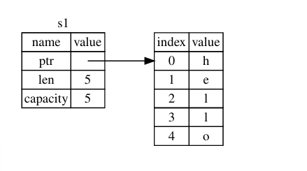
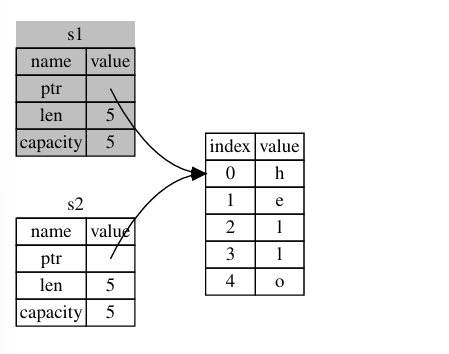
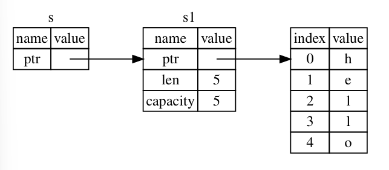
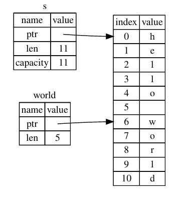

## What is Ownership?

*Ownership* is a set of rules that govern how a Rust program manages memory.
Some languages have garbage collection that regularly looks for no-longer-used memory as the program runs; 
in other languages, the programmer must explicitly allocate and free the memory like C and C++.
Rust come with different approach, manage memory through a system of ownership.

### The Stack and the Heap

Many programming languages don't require you to think about the stack and the heap. But in Rust stack or The heap
affect how the language behaves and why you have to make certain decisions.

Both the stack and the heap are parts of memory available to your code to use at runtime, but they are structured in
different ways. The stack is a memory structure that operates on a last in, first out (LIFO) principle, like a stack of 
plates where new plates are added to the top and removed from the top. Adding data is called pushing, and removing data 
is called popping. All data on the stack must have a fixed, known size at compile time. If the size is unknown or can 
change, the data is stored on the heap instead.

**Stack vs. Heap Speed:**
- Stack: Faster for data allocation since it always adds/removes at the top.
- Heap: Slower because it must search for space and manage bookkeeping.
Data Access:

- Stack: Faster because data is close in memory.
- Heap: Slower as it requires following pointers, which causes memory jumps.

**Function Behavior:**

- Parameters and local variables are stored on the stack.
- When the function ends, these values are removed.

**Ownership Role:**

- Ownership manages heap data by tracking usage, reducing duplication, and cleaning up unused memory.
- This ensures efficient memory use without requiring developers to manually manage the stack and heap.

Understanding ownership minimizes the need to worry about stack and heap differences in Rust.

### Ownership Rules
- Each value in Rust has an *owner*
- There can only ba one owner at a time
- When the owner out of scope, the value will be dropped

### Variable Scope
As a first example of ownership, we'll look at the scope of some variables.
```rust
let s = "hello";
```
The variable *s* refers a string literal, where the value of the string is hardcoded into text of our program.
The variable is valid until the end of the current scope. 
```rust
{                       // s is not valid here, it's not yet declared
    let s = "hello";    // s is valid from this point forward 
}                       // this scope is now over, and s is no longer valid
```
In other words, there are two important points in time here:

- When *s* comes into scope, it is valid
- It remains valid until it goes out of scope

### The String Type

You can create a *string* from a string literal using the *from* function, like so:
```rust
let s = String::from("hello");
```
The double colon :: operator allows us to namespace this particular *from* function under the *string* type rather than
using some sort of name like *string_from* .

This kind of string can be mutated:
```rust
    let mut s = String::from("hello");
    s.pus_str(", world!"); // pus_str() appends a literal to a string
    println!("{}", s); // This will print 'hello, world!`
```

### Memory and Allocation

In languages with a *garbage collector (GC)*, the GC keeps track of and cleans up memory that isn't being used anymore.
In most languages like C and C++ without GC, it's our responsibility to identify when memory is no longer being used and
call code to explicitly free it.

Rust take a different path: the memory is automatically return once the variable that owns it goes out of scope.
Here's an example using string instead of s string literal:
```rust
    let s = String::from("hello"); // s is valid from this point forward
    // do stuff with s
                                   // this scope is now over, and s is no longer valid 
```
When s goes out of scope, Rust calls a special function for us. This function is called *drop*, and it's where
the author of *string* can put the code to return the memory. Rust calls *drop* automatically at the closing curly
bracket.

```rust
Note: In C++, this pattern of deallocating resources at the end of an item’s lifetime is
sometimes called Resource Acquisition Is Initialization (RAII). The drop function in Rust
will be familiar to you if you’ve used RAII patterns.
```
#### Variable and Data Interacting with Move

Multiple variables can interact with the same data in different ways in Rust.

```rust
    let x = 5;
    let y = x;
    // Assigning the integer value of variable x to y
```
This
is indeed what is happening, because integers are simple values with a known, fixed size,
and these two 5 values are pushed onto the stack.
```rust
    // string version
    let s1 =  String::from("hello");
    let s2 = s2;
```
A String is
made up of three parts, shown on the left: a pointer to the memory that holds the contents
of the string, a length, and a capacity. This group of data is stored on the stack. On the right
is the memory on the heap that holds the contents.



*Representation in memory of a String holding the value "hello" bound to s1*

When we assign s1 to s2 , the String data is copied, meaning we copy the pointer, the
length, and the capacity that are on the stack. We do not copy the data on the heap that the
pointer refers to. 


*Representation in memory of the variable s2 that has a copy of the pointer, length, and capacity of
s1*

Rust instead copied the heap data as well. If Rust did this, the operation s2 = s1 could be
very expensive in terms of runtime performance if the data on the heap were large.


*Another possibility for what s2 = s1 might do if Rust copied the heap data as well*

This is a problem: when s2 and s1 go out of scope,
they will both try to free the same memory. This is known as a double free error and is one of
the memory safety bugs we mentioned previously. Freeing memory twice can lead to
memory corruption, which can potentially lead to security vulnerabilities.

To ensure memory safety, after the line let s2 = s1; , Rust considers s1 as no longer
valid. Therefore, Rust doesn’t need to free anything when s1 goes out of scope. Check out
what happens when you try to use s1 after s2 is created; it won’t work:

```rust
   let s1 = String::from("hello");
   let s2 = s1;
   println!("{}, world!", s1);
    // You'll get an error because Rust prevents you from using invalidated reference
```
But because Rust also invalidates the first variable,
instead of being called a shallow copy, it’s known as a move. 


*Representation in memory after s1 has been invalidated*

That solves our problem! With only s2 valid, when it goes out of scope it alone will free the
memory, and we’re done.

#### Variable and Data Interacting with Clone
If we do want to deeply copy the heap data of the *string*, not just the stack data, we can use a common method called
*clone* 

```rust
    let s1 = String::from("hello");
    let s2 = s1.clone();

    println!("s1 = {}, s2 = {}", s1, s2);
```
When you see call to *clone*, you know that some arbitrary code is being executed and that code may be expensive.

#### Stack-Only Data: Copy
```rust
  let x = 5;
  let y = x;
```
But this code seems to contradict what we just learned: we don't have a call to *clone*, but x is still valid and 
wasn't moved into y.

The reason is that types such as integers that have a known size at compile time are stored
entirely on the stack, so copies of the actual values are quick to make. That means there’s no
reason we would want to prevent x from being valid after we create the variable y .
In other words, there’s no difference between deep and shallow copying here, so calling clone
wouldn’t do anything different from the usual shallow copying, and we can leave it out.

Here are some of the types that implement *Copy* :

- All the integer types, such as u32.
- The Boolean type, *bool*, with values *true* and *false*.
- All the floating-point types such as *f64*.
- The character type, *char*.
- Tuples, if they only contain types that also implement *copy*. For example, (i32, i32) implements *Copy*, but
  (i32, string) does not.

#### Ownership and Functions
The mechanics of passing a value to a function are similar to those when assigning a value to a variable. Passing a
variable to a function will move or copy, just as assignment does.


*Functions with ownership and scope annotate*

If we tried to use s after the call to takes_ownership , Rust would throw a compile-time
error. These static checks protect us from mistakes. Try adding code to main that uses s
and x to see where you can use them and where the ownership rules prevent you from
doing so.

#### Return Values and Scope
Returning values can also transfer ownership.


*Transferring ownership of return values*

In Rust, assigning a value to another variable transfers ownership, and when a variable with heap data goes out of 
scope, its memory is cleaned up using drop. While this ensures safety, it can be tedious to pass ownership back and 
forth between functions if we want to reuse the value. To address this, Rust allows functions to use a value without 
taking ownership, avoiding the need to return it explicitly along with other data.

Rust does let us return multiple values using a tuple.
```rust
    // Returning ownership of parameters    
    fn main() {
        let s1 = String::from("hello");
        let (s2, len) = calculate_length(s1);
    
        println!("The length of '{}' is {}.", s2, len);
     }

      fn calculate_length(s: String) -> (String, usize) {
          let length = s.len(); // len() returns the length of a String (s, length)
     }  
```
But this is too much ceremony and a lot of work for a concept that should be common.
Luckily for us, Rust has a feature for using a value without transferring ownership, called *references*.

### References and Borrowing

A reference is like a pointer in that it's an address we can follow to access the data stored at that address (data is
owned by some other variable). Unlike a pointer, a reference is guaranteed to point to a valid value of particular type
for the life of that reference.

Example using reference with function *calculate_length*:

```rust
fn main(){
    let s1 =  String::from("hello");

    let len = calculate_length(&s1);

    println!("The length of '{}' is {}.", s1, len); 
}

fn calculate_length(s: &String) -> usize {
    s.len()
}
```
First, notice that all the tuple code in the variable declaration and the function return value is
gone. Second, note that we pass &s1 into calculate_length and, in its definition, we take
&String rather than String . These ampersands represent references, and they allow you
to refer to some value without taking ownership of it.



*A diagram of &String s pointing at string s1*

Note: The opposite of referencing by using & is dereferencing, which is accomplished
with the dereference operator, * .

```rust
  let s1 = String::from("hello");

  let len = calculate_length(&s1);
```
The &s1 syntax lets us create a reference that refers to the value of s1 but does not own it.
Because it does not own it, the value it points to will not be dropped when the reference
stops being used.

Likewise, the signature of the function uses & to indicate that the type of the parameter s
is a reference. Let’s add some explanatory annotations:

```rust
  fn calculate_length(s: &String) -> usize { // s is a reference to a String
  s.len()
  } // Here, s goes out of scope. But because it does not have ownership of what
    // it refers to, it is not dropped.
```
The variable s by reference is not dropped, because s doesn't have ownership. When functions have references as
parameters instead of the actual values, we won't need to return the values in order to give back ownership,
because we never had ownership.

Example in real life of reference borrowing, if a person owns something, you can borrow it from them. When you're done,
you have to give it back. You don't own it.

What happens if we try to modify something we're borrowing?
```rust
// Attempting to modify a  borrowed valid
fn main() {
    let s = String::from("hello");
    change(&s);
}
fn change(some_string: &String) {
    some_string.push_str(", world");
}
```
Here's the error"
```text
$ cargo run
   Compiling ownership v0.1.0 (file:///projects/ownership)
 error[E0596]: cannot borrow `*some_string` as mutable, as it is behind a `&` 
reference
 --> src/main.rs:8:5
   |
 7 | fn change(some_string: &String) {
   |                        ------- help: consider changing this to be a mutable 
reference: `&mut String`
 8 |     some_string.push_str(", world");
   |     ^^^^^^^^^^^^^^^^^^^^^^^^^^^^^^^ `some_string` is a `&` reference, so 
the data it refers to cannot be borrowed as mutable
For more information about this error, try `rustc --explain E0596`.
error: could not compile `ownership` due to previous error
```
Just as variables are immutable by default, so are references. We're not allowed to modify something we have a
reference to.

#### Mutable References

We can fix the code with modify value from borrowed with mutable references.

```rust
fn main() {
    let mut s = String::from("hello");
    change(&mut s);
}
fn change(some_string: &mut String) {
    some_string.push_str(", world");
}
```
First we change s to be mut. Then we create a mutable reference with *&mut* s where we call the change function, and
update the function signature to accept a mutable reference with *some_string: &mut String*. This makes it very clear
that the *change* function will mutate the value it borrows.

Keep in mind, if you have a mutable reference to a value, you can have no other references to that value. 

Example create two mutable references to s will fail:
```rust
let mut s = String::from("hello");
let r1 = &mut s;
let r2 = &mut s;
println!("{}, {}", r1, r2);
```
Here's the error:
```text
$ cargo run
   Compiling ownership v0.1.0 (file:///projects/ownership)
 error[E0499]: cannot borrow `s` as mutable more than once at a time
 --> src/main.rs:5:14
   |
 4 |     let r1 = &mut s;
   |              ------ first mutable borrow occurs here
 5 |     let r2 = &mut s;
   |              ^^^^^^ second mutable borrow occurs here
 6 |
 7 |     println!("{}, {}", r1, r2);
   |                        -- first borrow later used here
 For more information about this error, try `rustc --explain E0499`.
 error: could not compile `ownership` due to previous error
```

This error says that this code is invalid because we cannot borrow s as mutable more than once at a time.
The restriction on multiple mutable references enforces controlled mutation by allowing only one mutable
reference at a time. In Rust's you not allowed to have multiple mutable reference, in other language you can mutate
whenever you'd like. The benefit of having this restriction is that Rust can prevent data races at compile time. A data
race is similar to a race condition and happens when these three behaviors occur:

- Two or more pointers access the same data at the same time.
- At least one of the pointers is being used to write to the data.
- There’s no mechanism being used to synchronize access to the data.

Data races cause undefined behavior and can be difficult to diagnose and fix when you're trying to track them down at
runtime; Rust prevents this problem by refusing to compile code with data races!

Example for allowing multiple mutable references.
```rust
 let mut s = String::from("hello");
{
 let r1 = &mut s;
} // r1 goes out of scope here, so we can make a new reference with no problems.
 let r2 = &mut s;
```
Rust enforces s similar rule for combining mutable and immutable references. This code results in an error:
```rust
 let mut s = String::from("hello");
 let r1 = &s; // no problem
 let r2 = &s; // no problem
 let r3 = &mut s; // BIG PROBLEM
 println!("{}, {}, and {}", r1, r2, r3);
```
Here's the error:
```text
 $ cargo run
   Compiling ownership v0.1.0 (file:///projects/ownership)
 error[E0502]: cannot borrow `s` as mutable because it is also borrowed as 
immutable
 --> src/main.rs:6:14
   |
 4 |     let r1 = &s; // no problem
   |              -- immutable borrow occurs here
 5 |     let r2 = &s; // no problem
 6 |     let r3 = &mut s; // BIG PROBLEM
   |              ^^^^^^ mutable borrow occurs here
 7 |
 8 |     println!("{}, {}, and {}", r1, r2, r3);
   |                                -- immutable borrow later used here
For more information about this error, try `rustc --explain E0502`.
error: could not compile `ownership` due to previous error
```
We also cannot have mutable references while we have an immutable one to the same value.
Immutable references allow safe, simultaneous access for reading since the data cannot change unexpectedly.

A reference's scope runs from its introduction to its last use. The code compiles because the immutable references are 
used up before the mutable reference is introduced.

```rust
let mut s = String::from("hello");
let r1 = &s; // no problem
let r2 = &s; // no problem
println!("{} and {}", r1, r2);
// variables r1 and r2 will not be used after this point
let r3 = &mut s; // no problem
println!("{}", r3);
```
The immutable references' scopes end before the mutable reference begins, avoiding overlap and allowing the code. 
Rust’s borrowing rules prevent bugs by catching issues at compile time, saving debugging effort later.

#### Dangling References


In Rust, the compiler ensures references are never dangling by guaranteeing that data remains valid as long as a 
reference to it exists. This prevents errors common in pointer-based languages, where freeing memory while retaining 
a pointer can lead to issues.

```rust
 fn main() {
     let reference_to_nothing = dangle();
 }
 fn dangle() -> &String { // dangle returns a reference to a string
     let s = String::from("hello"); // s is a new String
   
     &s // we return a reference to the String,
 } // Here, s goes out of scope, and is dropped. Its memory goes away. Danger!
```
Here's the error:
```text
$ cargo run
   Compiling ownership v0.1.0 (file:///projects/ownership)
 error[E0106]: missing lifetime specifier
 --> src/main.rs:5:16
   |
 5 | fn dangle() -> &String {
   |                ^ expected named lifetime parameter
   |
  = help: this function's return type contains a borrowed value, but there is 
no value for it to be borrowed from
 help: consider using the `'static` lifetime
   |
 5 | fn dangle() -> &'static String {
   |                 +++++++
 For more information about this error, try `rustc --explain
```
Because s is created inside *dangle*, when the code of *dangle* is finished, s will be deallocated. But we tried to
return a reference to it. That means this reference would be pointing to an invalid *String*. Rust won't let us do this.

The solution here is to return the *String* directly.
```rust
fn no_dangle() -> String {
    let s = String::from("hello");
       
    s
 }
```
Here, ownership of *s* is given to the function call, so there are no dangling references.

##### The Rules of References
- At any given time, you can have *either* one mutable reference *or* any number of immutable references.
- References must always be valid.

### The Slice Type
*Slice* let you reference a contiguous sequence of elements in a collection rather than the whole collection.
A slice is kind of reference, so it does not have ownership.

Here’s a small programming problem: write a function that takes a string of words separated
by spaces and returns the first word it finds in that string. If the function doesn’t find a space
in the string, the whole string must be one word, so the entire string should be returned.


```rust
 fn main() {
     let mut s = String::from("hello world");
     let word = first_word(&s); // word will get the value 5
     s.clear(); // this empties the String, making it equal to ""
  
     // word still has the value 5 here, but there's no more string that
     // we could meaningfully use the value 5 with. word is now totally invalid!
 }
```
```rust
fn first_word(s: &String) -> usize {
    let bytes = s.as_bytes();
    for (i, &item) in bytes.iter().enumerate() { 
      if item == b' ' {
          return i;
      }
    }
  s.len()
}
```
This program compiles without any errors and would also do so if we used *word* after calling *s.clear(). Because *word*
isn't connected to the state of s at all, *word* still contains the value *5*. We cloud use that *5* with the
variable *s* to try to extract the first word out, but this would be a bug because the contents of *s* have changed
since we saved *5* in *word*.

#### String Slice
A *string slice* is a reference to part of a *String*, and it looks like this:
```rust
 let s = String::from("hello world");
 let hello = &s[0..5];
 let world = &s[6..11];
```

A slice in Rust is a reference to a portion of a String, defined by a range [starting_index..ending_index], where
starting_index is inclusive and ending_index is exclusive. Internally, a slice stores the starting position and its 
length (end - start). For example, let world = &s[6..11]; creates a slice starting at index 6 with a length of 5.



*String slice referring to part of a String*

With Rust's .. range syntax, if you want to star at index 0, you can drop the value before the two period. In other
words, these are equal:
```rust
 let s = String::from("hello");
 let slice = &s[0..2];
 let slice = &s[..2];
```
By the same token, if your slice includes the last byte of the *String*, you can drop the trailing number. That means
these are equal:
```rust
let s = String::from("hello");

let len = s.len();

let slice = &s[3..len];
let slice = &s[3..];
```
Entire string. So These are equal:
```rust
let s = String::from("hello");

let len = s.len();
 
let slice = &s[0..len];
let slice = &s[..];
```

```text
Note: String slice range indices must occur at valid UTF-8 character boundaries. If you
attempt to create a string slice in the middle of a multibyte character, your program
will exit with an error. 
```
Let's rewrite *first_word* to return a slice. The type that signifies *"string slice"* is written as *&str*:
```rust
fn first_word(s: &String) -> &str {
    let bytes = s.as_bytes();
    for (i, &item) in bytes.iter().enumerate() {
        if item == b' ' {
            return &s[0..i];
        }
    }
  
    &s[..]
 }
```
Now when we call first_word , we get back a single value that is tied to the underlying data.
The value is made up of a reference to the starting point of the slice and the number of
elements in the slice.

Returning a slice would also work for a *second_word* function:
```rust
fn second_word(s: &String) -> &str {
  
}
```

The problems would show up later if we kept trying to use the first word index with an empties string. Slices make this
bug impossible and let us know we have a problem without code much sooner. Using the slice version of *first_word* will
throw a compile-time error:
```rust
 fn main() {
     let mut s = String::from("hello world");
     let word = first_word(&s);
     s.clear(); // error!
    
     println!("the first word is: {}", word);
 }
```
Here's the compiler error:
```text
$ cargo run
   Compiling ownership v0.1.0 (file:///projects/ownership)
 error[E0502]: cannot borrow `s` as mutable because it is also borrowed as 
immutable
  --> src/main.rs:18:5
    |
 16 |     let word = first_word(&s);
    |                           -- immutable borrow occurs here
 17 |
 18 |     s.clear(); // error!
    |     ^^^^^^^^^ mutable borrow occurs here
 19 |
 20 |     println!("the first word is: {}", word);
    |                                       ---- immutable borrow later used here
For more information about this error, try `rustc --explain E0502`.
error: could not compile `ownership` due to previous error
```

Rust's borrowing rules prevent having a mutable reference and an immutable reference to the same data at the same time. 
Since clear requires a mutable reference to truncate the String, and the println! uses an immutable reference (word), 
Rust disallows this overlap, causing a compile-time error. This ensures safety and eliminates a class of runtime errors.

#### String Literals as Slices
String literals being stored inside the binary.
```rust
let s = "Hello, world!";
```
The type of *s* here is *&str* : it's a slice pointing to that specific point of the binary. This is also why
string literal are immutable; *&str* is an immutable reference.

#### String Slices as Parameters
Knowing that you can take slices of literals and *String* values leads us to one more improvement on *first_word*.
```rust
fn firts_word(s: &str) -> &str {
  
}
```
A more experienced Rustacean would write the signature shown in Listing 4-9 instead
because it allows us to use the same function on both &String values and &str values.
```rust
 // : Improving the first_word function by using a string slice for the type of the s parameter
 fn first_word(s: &str) -> &str { 
  
}
```
If we have a string slice, we can pass that directly. If we have a *String*, we can pass a slice of the String or a
reference to the *String*

Defining a function to take a string slice instead of a reference to a *String* makes our API more general and useful
without losing any functionality.
```rust
fn main() {
    let my_string = String::from("hello world");
    // `first_word` works on slices of `String`s, whether partial or whole
    let word = first_word(&my_string[0..6]);
    let word = first_word(&my_string[..]);
    // `first_word` also works on references to `String`s, which are equivalent
    // to whole slices of `String`s
    let word = first_word(&my_string);
    let my_string_literal = "hello world";
    // `first_word` works on slices of string literals, whether partial or whole
    let word = first_word(&my_string_literal[0..6]);
    let word = first_word(&my_string_literal[..]);
    // Because string literals *are* string slices already,
    // this works too, without the slice syntax!
    let word = first_word(my_string_literal);
 }
```

#### Other Slices
String slices there's more general slice type too.
```rust
let a = [1, 2, 3, 4, 5];
```
Just as we might want to refer to part of a string, we might want to refer to part of and array.
We'd do so like this:
```rust
let a = [1, 2, 3, 4, 5];
let slice = &a[1..3];
assert_eq!(slice, &[2, 3]);
```
The slice has the type *&[i32]. It works the same way as string slices do, by storing a reference to the first element
and a length. You'll use this kind of slice for all sorts of other collections.

### Summary
The concepts of ownership, borrowing, and slices unsure memory safety in Rust programs at compile time. The Rust
language gives you control over your memory usage in the same way as other systems programming languages, but having the
owner of data automatically clean up that data when the owner goes out of scope means you don't have to write and debug
extra code to get this control.

Ownership affects how lots of other part of Rust work, so we'll talk about these concepts further throughout the rest of
the book.